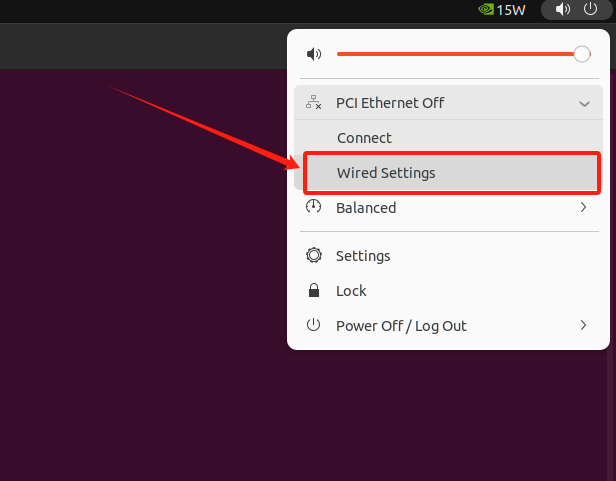
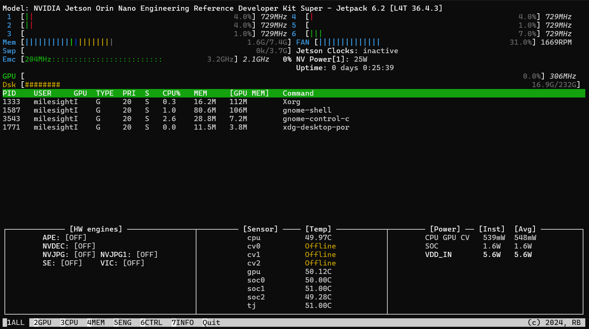

# Quick Start

## 概述

本章主要帮助您快速使用NG45XX系列产品。

## 硬件相关

- 硬件概述，参考：[Components Overview](http://192.168.13.9:3000/docs/Edge%20AI%20Box/NeoEdge%20NG45XX%20Series/Hardware%20Guide/Components%20Overview)

- 组装和连接，参考：[Hardware Connection](http://192.168.13.9:3000/docs/Edge%20AI%20Box/NeoEdge%20NG45XX%20Series/Hardware%20Guide/Hardware%20Connection)

## 软件相关

- 软件开发环境搭建，参考：[Development Environment Setup](http://192.168.13.9:3000/docs/Edge%20AI%20Box/NeoEdge%20NG45XX%20Series/Software%20Guide/Development%20Environment%20Setup)

- 软件烧录，参考：[System Flashing](http://192.168.13.9:3000/docs/Edge%20AI%20Box/NeoEdge%20NG45XX%20Series/Software%20Guide/System%20Flashing%20and%20Initialization)

## 首次系统启动引导配置

### 1. 用户配置

根据屏幕提示，完成System Configuration，步骤如下：

1. Check `accept license` ，continue

2. Set Language，continue

3. Set Keyboard layout，continue

4. Set timezone（eg : `Asia/Shanghai`），continue

5. Configuration 'Your name' and 'password' ，continue


6. Finally ，Waiting for system installation, automatic restart

### 2. 有线网络配置​（可选）

如需使用网络，请参考以下步骤：

- 点击桌面右上角 **Ethernet** → 选择 **"Wired Settings"**



- 在弹出的网络设置窗口中，选择当前的有线网络连接。

- 点击 `齿轮` 图标进入详细设置
  
  - 在 `IPv4` 标签页下，选择 `Manual`（手动）配置。
  
  - 输入静态 IP 地址、子网掩码和网关。例如：
    
    - **Address**: `192.168.60.3` (your desired static IP)
    
    - **Netmask**: `255.255.255.0` (or `/24` in CIDR notation)
    
    - **Gateway**: `192.168.60.1` (your router’s IP)
  
  - 在 DNS 部分，输入 DNS 服务器地址，例如 `8.8.8.8` 和 `8.8.4.4`。
  
  - 点击 `Apply` 保存设置。


- 配置完成后，重启网络以应用新的设置。

**网络验证**

- 打开终端，通过以下指令确认网络是否正常

```shell
ping google.com
```

### 3. 系统运行状态&版本确认

通过Jtop工具监控，参考以下步骤：

```shell
# 安装 Jtop 工具
sudo apt update
sudo apt install python3-pip
sudo pip3 install -U jetson-stats

# 重启服务
sudo systemctl restart jtop.service

#运行 Jtop
sudo jtop
```

运行后如下图所示，通过键盘查看当前 Jetson 设备的各种资源使用情况，包括 CPU、内存、GPU、磁盘、风扇等。



## NVIDIA Official Resource

**NVIDIA Jetson Software:**

 [Jetson Linux Developer Guide - Quick Start](https://docs.nvidia.com/jetson/archives/r34.1/DeveloperGuide/text/IN/QuickStart.html)

[Jetson Jetpack SDK](https://developer.nvidia.com/embedded/jetpack)

[Jetson FAQ](https://developer.nvidia.com/embedded/faq)

[Jetson Download Center](https://developer.nvidia.com/embedded/downloads)

[Download NVIDIA SDK Manager](https://developer.nvidia.com/sdk-manager)

**Software Forum:**

 [Jetson Developer Forum](https://forums.developer.nvidia.com/c/agx-autonomous-machines/jetson-embedded-systems)
