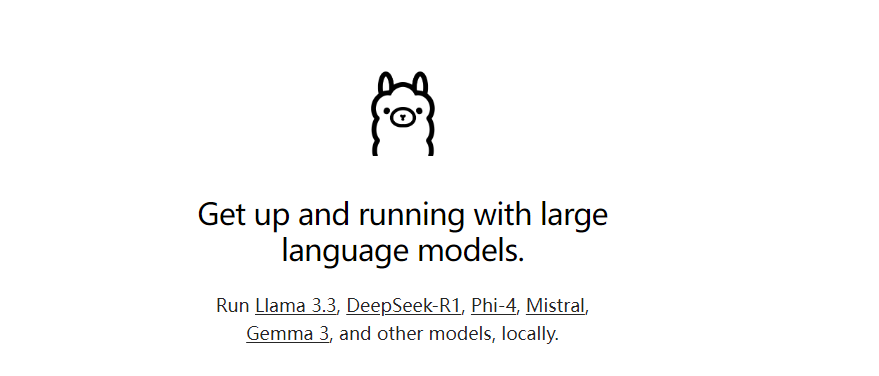

# Ollama

---

This guide walks through how to install, update, configure, and uninstall **Ollama** on NVIDIA **Jetson Orin** devices. Ollama enables local inference of large language models (LLMs) with CUDA support and is well-optimized for Jetson hardware.

---

## 1. Overview

- Fast local inference
- CUDA acceleration
- Model version management
- Easy CLI and optional WebUI

This document covers:

- Installation via script and Docker  
- Model execution  
- Version updates  
- Optional remote access configuration  
- Clean uninstallation  



---

## 2. System Requirements

### Hardware

| Component | Minimum Requirements             |
| --------- | -------------------------------- |
| Device    | Jetson Orin Nano / NX / AGX      |
| RAM       | ≥ 8GB for small/medium models    |
| Storage   | ≥ 10GB for model & cache storage |

### Software

- Ubuntu 20.04 or 22.04 (JetPack-based)
- JetPack 5.1.1+ (CUDA, cuDNN, TensorRT preinstalled)
- Python 3.8+ (optional)
- Docker (optional, for containerized mode)

---

## 3. Installing Ollama

### Method A: Script Installation (Recommended)

Run the official Ollama installer:

```bash
curl -fsSL https://ollama.com/install.sh | sh
```

- This will install the CLI binary and background service.
- CUDA support is included by default on Jetson.

### Method B: Docker-based Installation (Optional)

```bash
sudo docker run --runtime nvidia --rm --network=host \
  -v ~/ollama:/ollama \
  -e OLLAMA_MODELS=/ollama \
  dustynv/ollama:r36.4.0
```

> 🧩 Maintained by NVIDIA Jetson community (dustynv), optimized for JetPack environments.

---

## 4. Basic Usage

### Common Commands

```bash
ollama serve         # Start the Ollama backend
ollama run           # Run a model
ollama pull          # Pull model from registry
ollama list          # List installed models
ollama show          # Show model info
ollama rm            # Remove model
ollama help          # View help for commands
```

### Version Check

```bash
ollama -v
# Example: ollama version 0.5.7
```

### Starting the Service (If Not Auto-Started)

```bash
ollama serve &
```

---

## 5. Optional: Enable Remote Access

To allow external access to the Ollama service:

1. Edit the systemd service file:
   
   ```bash
   sudo nano /etc/systemd/system/ollama.service
   ```

2. Add the following under `[Service]`:
   
   ```ini
   Environment="OLLAMA_HOST=0.0.0.0"
   Environment="OLLAMA_ORIGINS=*"
   ```

3. Reload and restart the service:
   
   ```bash
   sudo systemctl daemon-reload
   sudo systemctl restart ollama
   ```

---

## 6. Running Models

Use the `ollama run` command to start inference with a model:

```bash
ollama run deepseek-r1:7b
```

- Other models are available at: [https://ollama.com/search](https://ollama.com/search)
- The first run will download the model; subsequent runs use cache.

---

## 7. Updating Ollama

To update to the latest version:

```bash
curl -fsSL https://ollama.com/install.sh | sh
```

### Optional: Install a Specific Version

Set the version in the install command:

```bash
curl -fsSL https://ollama.com/install.sh | OLLAMA_VERSION=0.1.32 sh
```

---

## 8. Uninstalling Ollama

### Remove the Service

```bash
sudo systemctl stop ollama
sudo systemctl disable ollama
sudo rm /etc/systemd/system/ollama.service
```

### Remove the Binary

```bash
sudo rm $(which ollama)
```

(Ollama is typically installed in `/usr/local/bin`, `/usr/bin`, or `/bin`.)

### Delete Model Files and User

```bash
sudo rm -r /usr/share/ollama
sudo userdel ollama
sudo groupdel ollama
```

---

## 9. Troubleshooting

| Issue                     | Solution                                            |
| ------------------------- | --------------------------------------------------- |
| Port 11434 not responding | Restart `ollama serve` or reload systemd service    |
| Install failed            | Ensure you have curl + internet; retry with `sudo`  |
| Can't remove ollama       | Check binary path with `which ollama`               |
| Out of memory (OOM)       | Use smaller model (`1.5b`, `7b`), or add swap space |

---

## 10. Appendix

### File Paths

| Purpose        | Path                                 |
| -------------- | ------------------------------------ |
| Ollama binary  | `/usr/local/bin/ollama`              |
| Model cache    | `~/ollama/` or `/usr/share/ollama`   |
| Service config | `/etc/systemd/system/ollama.service` |

### References

- [Ollama Official Site](https://ollama.com/)
- [GitHub Repository](https://github.com/ollama/ollama)
- [Jetson Community](https://forums.developer.nvidia.com/)
