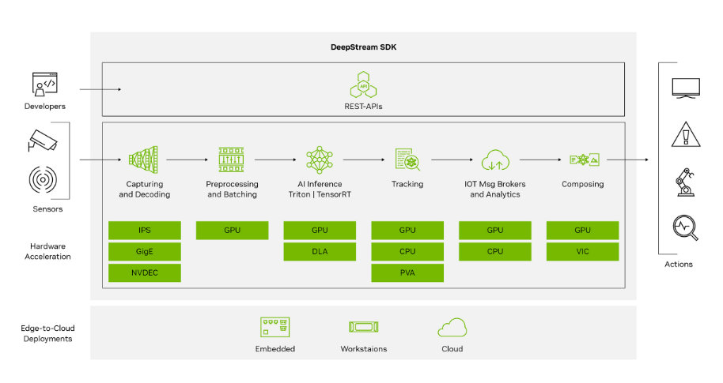

# DeepStream

---

This guide walks through how to install and run **NVIDIA DeepStream SDK** on **Jetson Orin** devices. DeepStream enables real-time video analytics using GPU-accelerated AI pipelines, optimized for Jetson’s CUDA/NvMedia stack.

---

## 1. Overview

- Real-time video analytics SDK by NVIDIA  
- Accelerated with TensorRT and CUDA  
- Multi-stream AI inference and tracking  
- Supports RTSP, USB, CSI, and file inputs  
- Built-in support for object detection, classification, tracking  

This document includes:

- Installation (deb & Docker)
- Sample pipeline execution
- Custom model integration
- Docker usage with jetson-containers (optional)
- Troubleshooting and tips



---

## 2. System Requirements

### Hardware

| Component | Minimum Requirements        |
| --------- | --------------------------- |
| Device    | Jetson Orin Nano / NX / AGX |
| RAM       | ≥ 8GB                       |
| Storage   | ≥ 10GB                      |

### Software

- JetPack 5.1.1 or higher (L4T ≥ R35.3)
- Ubuntu 20.04 / 22.04
- CUDA, TensorRT, cuDNN (included in JetPack)
- Docker (optional for containerized setup)

---

## 3. Installing DeepStream

### Method A: Native Installation (via .deb package)

1. Download the DeepStream package for Jetson:
   
   - Go to [DeepStream Jetson Download Page](https://developer.nvidia.com/deepstream-sdk-download-tesla#jetson)
   - Choose the correct version for your JetPack

2. Install with `dpkg`:

```bash
sudo apt install ./deepstream-<version>_arm64.deb
```

3. Verify installation:

```bash
deepstream-app --version
```

【image】*Fig: CLI output showing DeepStream installed and version info*

---

### Method B: Docker-Based Installation

If you prefer containerized workflows:

```bash
sudo docker run --rm -it --runtime=nvidia --network host \
  nvcr.io/nvidia/deepstream:6.3-triton-devel \
  /bin/bash
```

> 🧩 Available via NVIDIA NGC. Make sure your device is registered with [NGC](https://ngc.nvidia.com/).

You can also use [jetson-containers](https://github.com/dusty-nv/jetson-containers) for a pre-configured experience:

```bash
jetson-containers run dusty-nv/deepstream
```

---

## 4. Running a Sample Pipeline

### Step 1: Launch a Sample App

Run the default sample (object detection on video file):

```bash
deepstream-app -c /opt/nvidia/deepstream/deepstream/samples/configs/deepstream-app/source1_usb_dec_infer_resnet_int8.txt
```

This will open a video window and display detected objects in real time.

【image】*Fig: DeepStream running live object detection pipeline*

---

### Step 2: Use a USB or CSI Camera

Update the config file input section:

```ini
[source0]
enable=1
type=1
camera-width=1280
camera-height=720
camera-fps-n=30
```

Then run:

```bash
deepstream-app -c <your_camera_config>.txt
```

> 🎥 For USB cams, type=1. For CSI, use `nvarguscamerasrc`.

---

### Step 3: Run with RTSP Stream

Use this config snippet:

```ini
[source0]
enable=1
type=4
uri=rtsp://<your-camera-stream>
```

---

## 5. Running in Docker (Advanced)

Example: DeepStream 6.3 Triton + PyTorch in Docker:

```bash
sudo docker run -it --rm --runtime=nvidia \
  -v /tmp/.X11-unix:/tmp/.X11-unix \
  -e DISPLAY=$DISPLAY \
  nvcr.io/nvidia/deepstream:6.3-triton-devel
```

Inside container:

```bash
deepstream-app -c /opt/nvidia/deepstream/deepstream/samples/configs/deepstream-app/source1_usb_dec_infer_resnet_int8.txt
```

【image】*Fig: DeepStream running in Docker container with GUI passthrough*

---

## 6. Integrating Custom Models

DeepStream supports custom models via TensorRT or ONNX.

### Step 1: Convert your model

Use `trtexec` or `tao-converter`:

```bash
trtexec --onnx=model.onnx --saveEngine=model.engine
```

### Step 2: Update config

```ini
[primary-gie]
enable=1
model-engine-file=model.engine
network-type=0
```

【image】*Fig: Configuration block for custom model integration*

---

## 7. Tips & Troubleshooting

| Issue                   | Solution                                             |
| ----------------------- | ---------------------------------------------------- |
| No display in Docker    | Mount X11 socket & set `DISPLAY` variable            |
| Low FPS                 | Use TensorRT INT8 engine or reduce resolution        |
| USB camera not detected | Check `v4l2-ctl --list-devices`                      |
| GStreamer errors        | Ensure proper plugins installed (or reflash JetPack) |
| RTSP stream timeout     | Set `drop-frame-interval=0` and `latency=200`        |

---

## 8. Appendix

### Key Paths

| Purpose        | Path                                                 |
| -------------- | ---------------------------------------------------- |
| Sample configs | `/opt/nvidia/deepstream/deepstream/samples/configs/` |
| Model engines  | `/opt/nvidia/deepstream/deepstream/models/`          |
| Logs           | `/opt/nvidia/deepstream/logs/`                       |
| DeepStream CLI | `/usr/bin/deepstream-app`                            |

### References

- [DeepStream Developer Page](https://developer.nvidia.com/deepstream-sdk)
- [NGC Registry - DeepStream](https://catalog.ngc.nvidia.com/orgs/nvidia/containers/deepstream)
- [GitHub - dusty-nv/jetson-containers](https://github.com/dusty-nv/jetson-containers)
- [NVIDIA Forums - DeepStream](https://forums.developer.nvidia.com/c/deepstream-sdk/)
