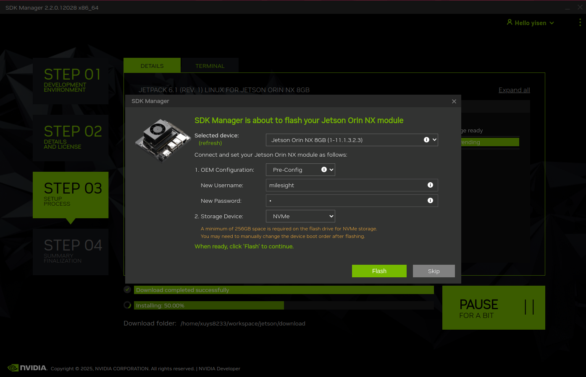

# System  Flashing

## 系统烧录

   本小结会介绍两种烧录方式：**AIBOX烧录方法** 和 **官方烧录方法**。

## 主机环境配置

- 编程环境：ubuntu20.04（需要预留100GB以上的空间去下载镜像资源）

- 下载 [SDK Manager](https://developer.nvidia.com/sdk-manager) deb包，将deb拷贝到用户的目录下

- 启动终端后，运行下面的指令去安装SDK Manager
  
  ```shell
  sudo dpkg -i sdkmanager_2.2.0-12021_amd64.deb  # deb版本替换为您下载的版本
  ```

## 硬件配置

软件烧录前，需要完成下述硬件操作。

- 如下图所示，使用跳帽短接FC REC和GND ，然后给AIBox开发板上电
  
                      （后续替换成改版后的拨码开关图片）


- 将 Micro USB 线从 JESTON 的 Micro USB 端口连接到 Linux 主机 PC 的 USB TypeA 端口。

- 然后通过指令`lsusb`检查设备是否处于recovery模式，你会看到带有 ID 0955:623 的 NVidia Corp 设备。**（注：如果出现NVidia Corp 设备，说明未正确进入recovery模式，请检查跳帽和usb线缆。）**
  

- 确认进入recovery模式后，拔掉短接的跳帽。

## AIBOX烧录方法

- 下载AIBOX 烧录包，链接：

- 烧录指令如下：

```shell
# 解压烧录包，mfi_aibox-orin-nano-NG45XX-super-8g-36.4.3-V1.0.tar.gz替换为实际烧录包
sudo tar -zxvf mfi_aibox-orin-nano-NG45XX-super-8g-36.4.3-V1.0.tar.gz -C ./

# 烧录
sudo ./tools/kernel_flash/l4t_initrd_flash.sh --network usb0 --flash-only --showlogs
```

## 官方烧录方法

### 方法一：CMD方式烧录

- 手动下载软件包
  
  - 进入 [Jetson Linux Archive](https://developer.nvidia.com/embedded/jetson-linux-archive) 链接，选择所需要的软件版本
  
  - 在主机中，下载BSP和rootfs到本地

- 解压BSP和rootfs，指令参考如下：
  
  ```shell
  # ${L4T_RELEASE_PACKAGE} eg:Jetson_Linux_R36.4.3_aarch64.tbz2
  # ${SAMPLE_FS_PACKAGE}   eg:Tegra_Linux_Sample-Root-Filesystem_R36.4.3_aarch64.tbz2
  # 替换为实际下载的BSP和ROOTFS
  tar xf ${L4T_RELEASE_PACKAGE}
  sudo tar xpf ${SAMPLE_FS_PACKAGE} -C Linux_for_Tegra/rootfs/
  cd Linux_for_Tegra/
  sudo ./tools/l4t_flash_prerequisites.sh
  sudo ./apply_binaries.sh
  ```

- 配置您的用户名，密码和主机名
  
  ```shell
  sudo tools/l4t_create_default_user.sh -u <USERNAME> -p <PASSWORD> -a -n <HOSTNAME> --accept-license
  ```

- 在终端中输入下面指令，将系统烧录到 NVMe SSD
  
  ```shell
  sudo ./tools/kernel_flash/l4t_initrd_flash.sh --external-device nvme0n1p1 \  
  -c tools/kernel_flash/flash_l4t_t234_nvme.xml -p "-c bootloader/generic/cfg/flash_t234_qspi.xml" \  
  --showlogs --network usb0 jetson-orin-nano-devkit internal
  ```

- 当看到下述信息即完成烧录，然后重启JETSON即可。

**注**：烧录其他外部位置，参考 [Flashing Support]([Flashing Support — NVIDIA Jetson Linux Developer Guide](https://docs.nvidia.com/jetson/archives/r36.4.3/DeveloperGuide/SD/FlashingSupport.html))

### 方法二：SDK Manager方式烧录

- 完成SDK Manager的安装后，启动终端运行sdkmanager , 点击 “LOGIN”，登录到您的 NVIDIA 帐户，浏览器弹出链接，并输入您的注册电子邮件和密码登录。
  
  

- 成功登入后，进入“STEP 01”参考按照下述配置选择
  
  - 从“**Product Category**”面板中，选择Jetson
  
  - 从“**System Configuration**”面板中，选择当前连接的设备型号。（默认USB线缆连接后，进入recovery mode时，默认会自动显示当前的硬件设备，如未显示，请点击刷新）
    
    
  
  - 从“**SDK VERSION**”面板中，选择所需JetPack SDK版本，点击右下角 (...)可以查看更多版本选择。
    
    
  
  - 完成选择后，点击“**Continue**”进入下一步

- Step2， 选择所需组件和接受许可证
  
  - 在该步骤可以查看到将要安装的组件。（如第一次验证，可以取消选择Jetson相关的组件，仅保留Jetson的镜像即可）
  
  - 检查屏幕底部的下载和安装选项路径，接着检查组件并接受许可证。
    
    
  
  - 选择“**Continue**”继续下一步

- Step3，安装
  
  - 点击“INSTALL”后，SDK Manager 会提示您输入 root 密码
    
    
  
  - SDK Manager软件会显示下载和安装的进度
    
    
  
  - 当下载完烧录镜像后，会跳出来以下页面，可以填入JESTON预设账户密码，以及选择“**NVMe**”
    
    

- Step 04， 完成烧录
  
  - 烧录完成如下图，点击 ”**FINISH**“ 完成烧录，重启JESTON即使用。
  
  

## 参考

[NVIDIA - Flashing Support](https://docs.nvidia.com/jetson/archives/r36.4/DeveloperGuide/SD/FlashingSupport.html)
