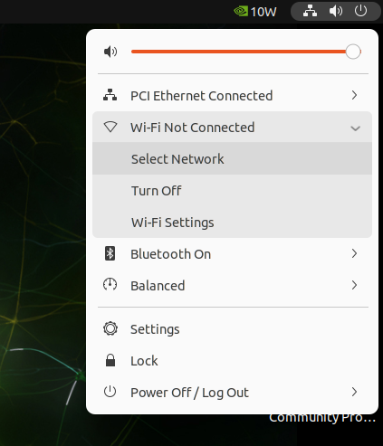

# WIFI

本文档介绍了wifi 驱动安装和使用的说明，以rtl8821为例。

# 方法

有两种方式安装和使用。

1. 直接在系统内下载安装

2. 下载源码编译后烧写

## 系统内安装

进入系统后执行以下命令自动安装驱动程序

```
$ sudo apt update
$ sudo apt install rtl8821ce-dkms
```

完成后执行modprobe

```
$ sudo modprobe rtl8821ce
```

执行demsg可看到相关的log，说明驱动设备已经成功加载。

```
[   10.805932] rtl8821ce 0001:01:00.0: Adding to iommu group 3
[   10.806901] rtl8821ce 0001:01:00.0: enabling device (0000 -> 0003)
[   11.077841] Bluetooth: hci0: RTL: loading rtl_bt/rtl8821c_fw.bin
[   11.079036] Bluetooth: hci0: RTL: loading rtl_bt/rtl8821c_config.bin
[   11.320620] rtl8821ce 0001:01:00.0 wlP1p1s0: renamed from wlan0
```

## 使用源码编译

### 代码获取

源码的获取可以在github上查找，或者由wifi厂家提供

rtl8821 github的源码在[GitHub - tomaspinho/rtl8821ce](https://github.com/tomaspinho/rtl8821ce)

### 编译

将源码放到工程目录Linux_for_Tegra/source/nvidia-oot/drivers对应的驱动下，例如

Linux_for_Tegra/source/nvidia-oot/drivers/net/wireless/realtek

修改Makefile，将rtl8821ce加入编译

```
obj-m += rtl8821ce/
```

根据实际情况修改驱动编译的Makefile

rtl8821ce目录下Makefile修改的diff如下

```
diff --git a/Makefile b/Makefile
index 5b5dc9a..01b1e24 100755
--- a/Makefile
+++ b/Makefile
@@ -15,6 +15,8 @@ EXTRA_CFLAGS += -Wno-unused-parameter
 EXTRA_CFLAGS += -Wno-unused-function
 EXTRA_CFLAGS += -Wno-unused
 #EXTRA_CFLAGS += -Wno-uninitialized
+EXTRA_CFLAGS += -Wno-missing-prototypes
+EXTRA_CFLAGS += -Wno-error=misleading-indentation

 GCC_VER_49 := $(shell echo `$(CC) -dumpversion | cut -f1-2 -d.` \>= 4.9 | bc )
 ifeq ($(GCC_VER_49),1)
@@ -29,6 +31,7 @@ else
     export TopDIR ?= $(srctree)/$(src)
 endif

+TopDIR = $(srctree.nvidia-oot)/drivers/net/wireless/realtek/rtl8821ce
 EXTRA_CFLAGS += -I$(TopDIR)/include

 EXTRA_LDFLAGS += --strip-debug
@@ -113,7 +116,8 @@ CONFIG_RTW_SDIO_PM_KEEP_POWER = y
 ###################### MP HW TX MODE FOR VHT #######################
 CONFIG_MP_VHT_HW_TX_MODE = n
 ###################### Platform Related #######################
-CONFIG_PLATFORM_I386_PC = y
+CONFIG_PLATFORM_TEGRA = y
+CONFIG_PLATFORM_I386_PC = n
 CONFIG_PLATFORM_ANDROID_X86 = n
 CONFIG_PLATFORM_ANDROID_INTEL_X86 = n
 CONFIG_PLATFORM_JB_X86 = n
@@ -1212,6 +1216,15 @@ endif

 EXTRA_CFLAGS += -DDM_ODM_SUPPORT_TYPE=0x04

+ifeq ($(CONFIG_PLATFORM_TEGRA), y)
+ARCH = arm
+KVER := $(shell uname -r)
+KSRC := /lib/modules/$(KVER)/build
+EXTRA_CFLAGS += -DCONFIG_LITTLE_ENDIAN
+EXTRA_CFLAGS += -DCONFIG_IOCTL_CFG80211 -DRTW_USE_CFG80211_STA_EVENT
+EXTRA_CFLAGS += -Wno-error=date-time
+MODULE_NAME = rtl8821ce
+endif
 ifeq ($(CONFIG_PLATFORM_I386_PC), y)
 EXTRA_CFLAGS += -DCONFIG_LITTLE_ENDIAN
 EXTRA_CFLAGS += -DCONFIG_IOCTL_CFG80211 -DRTW_USE_CFG80211_STA_EVENT
@@ -2232,7 +2245,7 @@ ifeq ($(CONFIG_RTL8723B), y)
 $(MODULE_NAME)-$(CONFIG_MP_INCLUDED)+= core/rtw_bt_mp.o
 endif

-obj-$(CONFIG_RTL8821CE) := $(MODULE_NAME).o
+obj-m := $(MODULE_NAME).o

 else
```

修改后，执行kernel编译命令或者单独编译模块install到rootfs下，后续烧录即可。编译和烧录参考前面相关文档。

## 使用与验证

系统启动后执行modprobe

```
$ sudo modprobe rtl8821ce
```

使用命令lspci查看pci总线上的设备

```
0001:01:00.0 Network controller: Realtek Semiconductor Co., Ltd. RTL8821CE 802.11ac PCIe Wireless Network Adapter
```

dmesg命令可以看到设备被添加成功

```
$ sudo dmesg | grep rtl
[    9.785137] rtl8821ce 0001:01:00.0: Adding to iommu group 3
[    9.785307] rtl8821ce 0001:01:00.0: enabling device (0000 -> 0003)
[   10.010615] Bluetooth: hci0: RTL: loading rtl_bt/rtl8821c_fw.bin
[   10.011780] Bluetooth: hci0: RTL: loading rtl_bt/rtl8821c_config.bin
[   10.441574] rtl8821ce 0001:01:00.0 wlP1p1s0: renamed from wlan0
```

连接wifi



ifconfig查看网络设备

```
wlP1p1s0: flags=4163<UP,BROADCAST,RUNNING,MULTICAST>  mtu 1500
        inet 192.168.204.218  netmask 255.255.255.0  broadcast 192.168.204.255
        inet6 fe80::aba:6776:77ec:4831  prefixlen 64  scopeid 0x20<link>
        inet6 2409:8934:20d4:908:f2b8:fd54:f19a:a11a  prefixlen 64  scopeid 0x0<global>
        inet6 2409:8934:20d4:908:5de2:d217:83e0:d943  prefixlen 64  scopeid 0x0<global>
        ether a4:e8:8d:0f:e4:ce  txqueuelen 1000  (Ethernet)
        RX packets 2060  bytes 2644294 (2.6 MB)
        RX errors 0  dropped 48  overruns 0  frame 0
        TX packets 1656  bytes 195010 (195.0 KB)
        TX errors 0  dropped 0 overruns 0  carrier 0  collisions 0ons 0
```

使用ping测试网络连接

```
$ ping -I wlP1p1s0 www.baidu.com
PING www.baidu.com(2409:8c20:6:1d55:0:ff:b09c:7d77 (2409:8c20:6:1d55:0:ff:b09c:7d77)) from 2409:8934:20d4:908:5de2:d217:83e0:d943 wlP1p1s0: 56 data bytes
64 bytes from 2409:8c20:6:1d55:0:ff:b09c:7d77 (2409:8c20:6:1d55:0:ff:b09c:7d77): icmp_seq=1 ttl=48 time=88.7 ms
64 bytes from 2409:8c20:6:1d55:0:ff:b09c:7d77 (2409:8c20:6:1d55:0:ff:b09c:7d77): icmp_seq=2 ttl=48 time=50.8 ms
64 bytes from 2409:8c20:6:1d55:0:ff:b09c:7d77 (2409:8c20:6:1d55:0:ff:b09c:7d77): icmp_seq=3 ttl=48 time=80.5 ms
64 bytes from 2409:8c20:6:1d55:0:ff:b09c:7d77 (2409:8c20:6:1d55:0:ff:b09c:7d77): icmp_seq=4 ttl=48 time=86.1 ms
```


